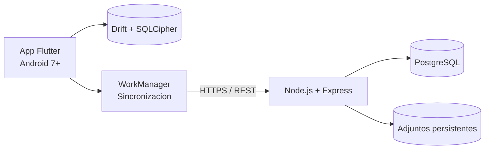

# Notium

Notium es una aplicacion Android de notas **offline-first**. Permite crear,
editar, eliminar y adjuntar archivos sin conexion; cuando vuelve la red,
sincroniza los cambios entre dispositivos y conserva un historial auditable de
los conflictos resueltos.

## Lo que demuestra el proyecto

- Experiencia offline completa con SQLite cifrado mediante SQLCipher.
- UI reactiva basada en una unica fuente de verdad local (Drift + Riverpod).
- Sincronizacion incremental `push -> pull` con reintentos y tareas en segundo plano.
- Resolucion de conflictos Last-Write-Wins con trazabilidad del valor descartado.
- Autenticacion JWT con rotacion de refresh tokens.
- API REST documentada con OpenAPI y respaldada por PostgreSQL.
- Pruebas unitarias, de widgets, contrato e integracion entre dos dispositivos.

## Arquitectura



| Capa | Tecnologias |
| --- | --- |
| Aplicacion | Flutter, Dart, Riverpod, Drift, Dio |
| Persistencia local | SQLite, SQLCipher, Android Keystore |
| Segundo plano | WorkManager, connectivity_plus |
| Backend | Node.js, Express, PostgreSQL, JWT |
| Operacion | Docker Compose, Caddy, HTTPS |
| Calidad | flutter_test, Jest, Supertest, OpenAPI |

## Estructura

```text
app/       Cliente Flutter para Android
backend/   API REST y migraciones PostgreSQL
doc/       Arquitectura, casos de uso y contrato OpenAPI
```

## Ejecucion local

Backend:

```bash
cd backend
docker compose up --build
```

Aplicacion, desde un emulador Android:

```bash
cd app
flutter pub get
flutter run
```

El valor predeterminado de la app usa `http://10.0.2.2:3000/v1`, la direccion
del equipo anfitrion vista desde el emulador Android.

## Publicacion

- [Despliegue desde el panel de Dokploy](backend/DEPLOY-DOKPLOY.md)
- [Despliegue del backend en un VPS](backend/DEPLOY-VPS.md)
- [Compilacion y firma del APK](app/RELEASE.md)
- [Texto listo para el portafolio](PORTFOLIO.md)
- [Contrato OpenAPI](doc/openapi.yaml)
- [Pruebas manuales](app/PRUEBAS-MANUALES.md)

## Estado

Version actual: `1.0.0`. El producto se encuentra preparado como demostracion
tecnica/academica. Antes de usarlo con informacion real se recomienda agregar
monitoreo, copias de seguridad automatizadas y almacenamiento de objetos para
los adjuntos.

## Autor

Jhonatan Castro — proyecto ADSO, SENA.
