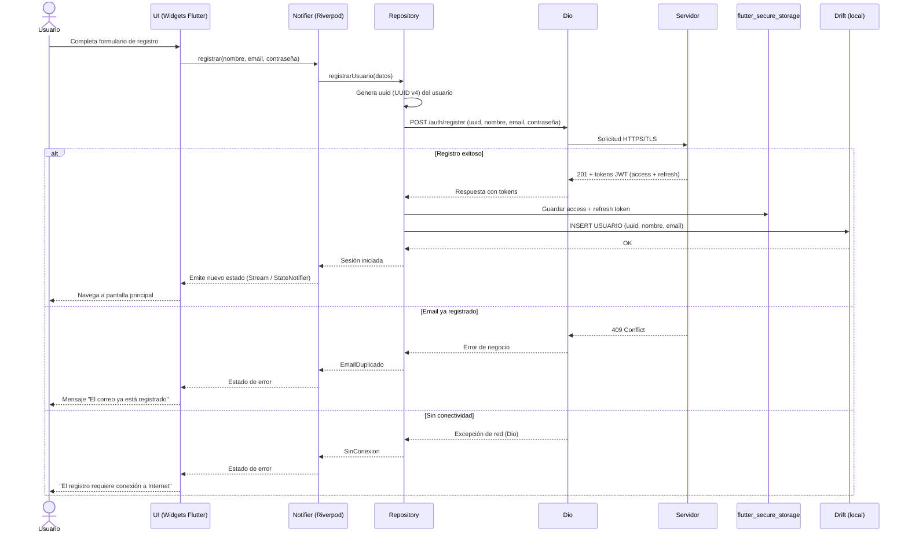
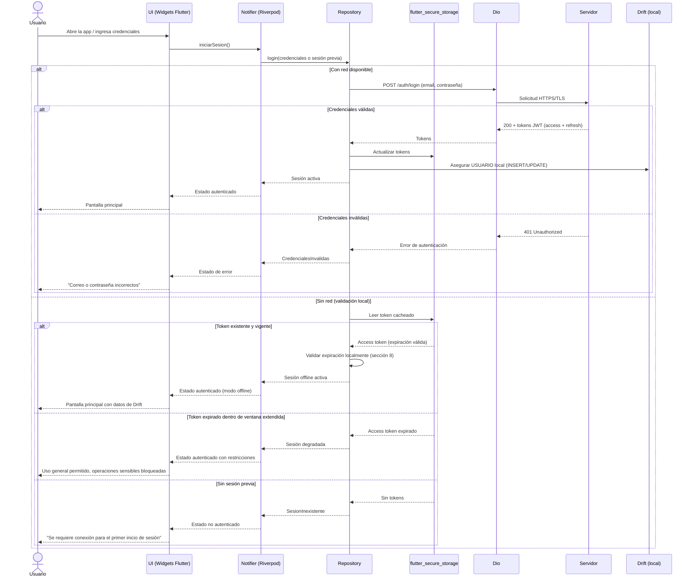
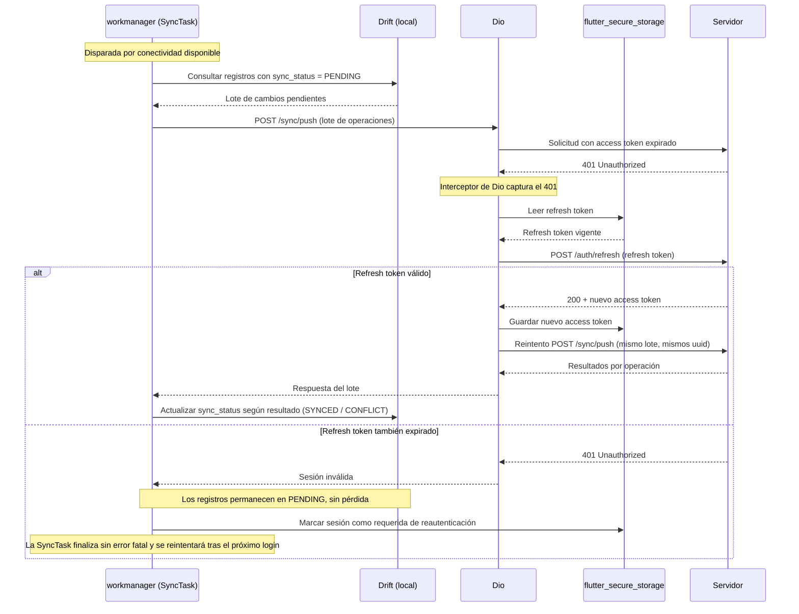
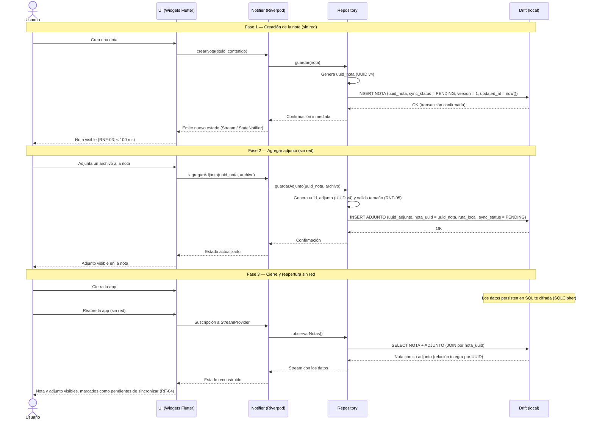
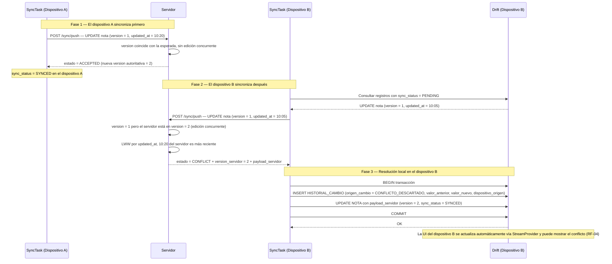
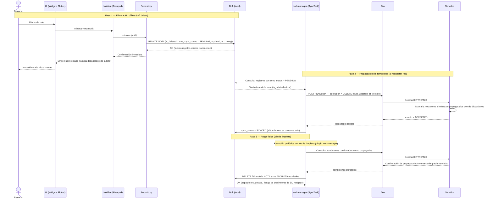
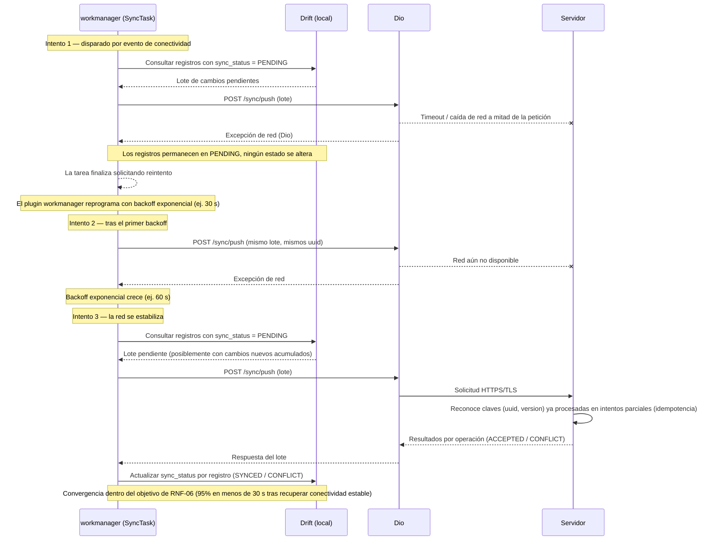
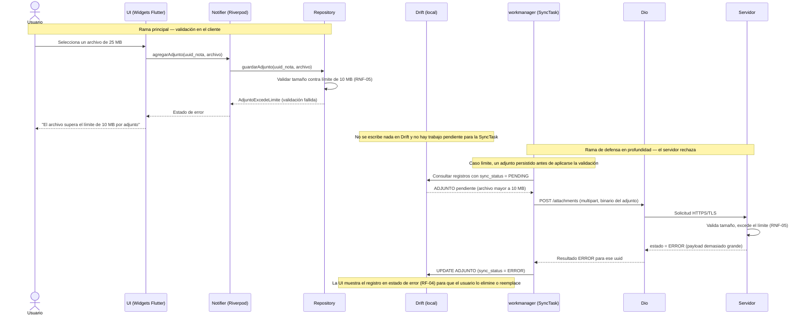

# Casos de Uso Críticos — Diagramas de Secuencia

**Proyecto:** Notium — Plataforma offline-first
**Documento complementario a:** Propuesta de Arquitectura de Software v1.4 (`doc.md`)
**Autor:** Jhonatan Castro
**Fecha:** 06 de julio de 2026

Este documento detalla los flujos de interacción entre los componentes definidos en la sección 3 del documento de arquitectura: UI (Widgets Flutter), Notifier (Riverpod), Repository, Drift (base de datos local), Dio (cliente API REST), la `SyncTask` (plugin `workmanager`), `flutter_secure_storage` y el servidor backend. Cada caso de uso cubre el flujo principal (*happy path*) y los casos límite más relevantes.

---

## Tabla de contenido

1. [CU-01 Registro de usuario nuevo (con red)](#cu-01-registro-de-usuario-nuevo-con-red)
2. [CU-02 Login con red y sin red (token cacheado)](#cu-02-login-con-red-y-sin-red-token-cacheado)
3. [CU-03 Refresco automático de token JWT expirado durante sincronización](#cu-03-refresco-automático-de-token-jwt-expirado-durante-sincronización)
4. [CU-04 Crear nota con adjunto y reabrir la app sin red](#cu-04-crear-nota-con-adjunto-y-reabrir-la-app-sin-red)
5. [CU-05 Conflicto de edición concurrente y resolución Last-Write-Wins](#cu-05-conflicto-de-edición-concurrente-y-resolución-last-write-wins)
6. [CU-06 Eliminación offline con tombstone y purga posterior](#cu-06-eliminación-offline-con-tombstone-y-purga-posterior)
7. [CU-07 Reintento con backoff exponencial ante red intermitente](#cu-07-reintento-con-backoff-exponencial-ante-red-intermitente)
8. [CU-08 Adjunto que excede el límite de 10 MB](#cu-08-adjunto-que-excede-el-límite-de-10-mb)

---

## CU-01 Registro de usuario nuevo (con red)

| Campo | Detalle |
| ----- | ------- |
| **Actores** | Usuario, Servidor |
| **Precondiciones** | La app está instalada; hay conectividad disponible; el usuario no posee cuenta. |
| **Postcondiciones** | El usuario queda registrado en el servidor; los tokens JWT (access + refresh) se almacenan en `flutter_secure_storage`; la entidad `USUARIO` queda persistida en Drift como caché local del perfil. |

El registro requiere red: la creación de la cuenta debe validarse en el servidor (unicidad del email) antes de habilitar el uso de la app. No obstante, el `uuid` del usuario se genera en el cliente (UUID v4, sección 5.1 del documento de arquitectura), de modo que el servidor solo lo *acepta*, manteniendo el mismo esquema de identidad que el resto de entidades.

**Puntos críticos:**

- El `uuid` del usuario se genera en el cliente **antes** de la petición, manteniendo la coherencia con la estrategia de identificadores (sección 5.1).
- Los tokens **nunca** se escriben en Drift; van exclusivamente a `flutter_secure_storage` (sección 8 y nota de la sección 4.1).
- La entidad `USUARIO` no lleva metadatos de sincronización (sección 4.2 del documento de arquitectura): se crea directamente contra el servidor vía `/auth/register` y se persiste en Drift solo como caché local del perfil, por lo que nunca pasa por la `SyncTask`.

**Errores posibles y manejo:**

| Error | Manejo |
| ----- | ------ |
| Email duplicado (409) | Mensaje de negocio en la UI; no se persiste nada localmente. |
| Sin conectividad / timeout | Se informa que el registro requiere red; el formulario conserva los datos ingresados. |
| Error del servidor (5xx) | Mensaje genérico con opción de reintentar; la operación es segura de repetir porque el servidor valida unicidad por email y `uuid`. |

---

## CU-02 Login con red y sin red (token cacheado)

| Campo | Detalle |
| ----- | ------- |
| **Actores** | Usuario, Servidor (solo en la variante con red) |
| **Precondiciones** | El usuario posee cuenta. Para la variante sin red: existe una sesión previa con tokens cacheados en `flutter_secure_storage`. |
| **Postcondiciones** | El usuario accede a la app. Con red: tokens renovados. Sin red: sesión validada localmente contra la expiración del token cacheado. |

**Puntos críticos:**

- La validación offline consiste en verificar **localmente** la expiración del token cacheado (sección 8); no hay llamada de red.
- El token expirado estando offline no bloquea el uso general: aplica la mitigación de la sección 9 (ventana de expiración extendida; solo se bloquean operaciones sensibles hasta reautenticar).
- El primer inicio de sesión de un dispositivo siempre requiere red: sin tokens cacheados no hay forma segura de validar identidad localmente.

**Errores posibles y manejo:**

| Error | Manejo |
| ----- | ------ |
| Credenciales inválidas (401) | Mensaje en UI; no se altera la sesión cacheada previa si existía. |
| Sin red y sin sesión previa | Se informa que el primer login requiere conexión. |
| Token expirado offline | Sesión degradada: uso general permitido, operaciones sensibles bloqueadas; al reconectar se refresca automáticamente (CU-03). |
| Fallo de lectura de `flutter_secure_storage` | Se trata como sesión inexistente y se solicita login con red. |

---

## CU-03 Refresco automático de token JWT expirado durante sincronización

| Campo | Detalle |
| ----- | ------- |
| **Actores** | `SyncTask` (sin intervención del usuario), Servidor |
| **Precondiciones** | Hay registros con `sync_status = PENDING`; hay red; el access token cacheado está expirado pero el refresh token es válido. |
| **Postcondiciones** | El access token queda renovado en `flutter_secure_storage`; el lote de sincronización se envía con éxito. |

Este flujo corresponde a la política de la sección 8: "al reconectar, se intenta refrescar el token automáticamente antes de sincronizar". El interceptor de Dio centraliza la detección del 401 y el reintento.

**Puntos críticos:**

- El reintento del lote reutiliza los **mismos `uuid`**: la idempotencia del endpoint `/sync/push` por la clave `(uuid, version)` (sección 5.5) garantiza que un lote parcialmente procesado antes del 401 no duplique datos.
- Los registros pendientes **nunca** cambian de estado por un fallo de autenticación: permanecen en `PENDING` hasta que la sincronización se complete realmente.
- El interceptor de Dio evita duplicar la lógica de refresco en cada punto de la capa de datos.

**Errores posibles y manejo:**

| Error | Manejo |
| ----- | ------ |
| Access token expirado (401) | Refresco automático transparente vía interceptor de Dio; reintento del lote. |
| Refresh token expirado | La sincronización se pospone; los datos quedan en `PENDING`; el usuario deberá reautenticarse en la próxima apertura con red (CU-02). |
| Caída de red durante el refresco | La `SyncTask` finaliza con reintento programado por el plugin `workmanager` con backoff exponencial (CU-07). |

---

## CU-04 Crear nota con adjunto y reabrir la app sin red

| Campo | Detalle |
| ----- | ------- |
| **Actores** | Usuario |
| **Precondiciones** | Sesión activa (posiblemente offline). No se requiere red en ningún punto del flujo. |
| **Postcondiciones** | La nota y su adjunto persisten en Drift con `sync_status = PENDING` y la relación `ADJUNTO.nota_uuid → NOTA.uuid` intacta tras cerrar y reabrir la app sin red. |

Este caso verifica la propiedad central de la sección 5.1: los UUID v4 generados en el cliente permiten crear **relaciones completas entre entidades sin red**, sin esperar IDs del servidor.

**Puntos críticos:**

- Cada `INSERT` marca `sync_status = PENDING` **en la misma transacción** que la escritura del dato (sección 5.2), garantizando que ningún cambio quede fuera de la cola implícita de sincronización.
- La relación nota-adjunto se construye con el `uuid_nota` generado en el cliente: no existe ninguna dependencia de un ID de servidor, por lo que la integridad referencial sobrevive al cierre de la app y a periodos offline indefinidos (RNF-01).
- El archivo físico del adjunto se guarda en almacenamiento local y se referencia por `ruta_local`; `url_remota` permanece vacía hasta que la sincronización lo suba.
- La UI muestra el estado de sincronización de cada registro (RF-04), informando al usuario que los cambios están pendientes.

**Errores posibles y manejo:**

| Error | Manejo |
| ----- | ------ |
| Fallo de escritura en Drift (disco lleno, excepción) | La transacción se revierte de forma atómica; la UI recibe un estado de error y ningún registro queda a medias. |
| Adjunto que excede 10 MB | Rechazo en la validación del Repository antes de persistir (ver CU-08). |
| Cierre abrupto de la app durante la escritura | La atomicidad transaccional de Drift garantiza que la operación se aplicó completa o no se aplicó; no hay estados intermedios. |

---

## CU-05 Conflicto de edición concurrente y resolución Last-Write-Wins

| Campo | Detalle |
| ----- | ------- |
| **Actores** | `SyncTask` del dispositivo A, `SyncTask` del dispositivo B, Servidor |
| **Precondiciones** | La misma nota (mismo `uuid`) existe sincronizada en ambos dispositivos con `version = 1`. Ambos la editan estando offline. |
| **Postcondiciones** | Ambos dispositivos convergen al estado autoritativo del servidor (RNF-02). El cambio descartado queda registrado en `HISTORIAL_CAMBIO` con `origen_cambio = CONFLICTO_DESCARTADO` (RF-05). |

Escenario: el dispositivo A edita la nota a las 10:20 y el dispositivo B a las 10:05 (edición más antigua). A recupera red y sincroniza primero; cuando B sincroniza, el servidor detecta la edición concurrente vía `version` y resuelve por Last-Write-Wins sobre `updated_at` (sección 5.3): el cambio de B, más antiguo, se descarta del estado autoritativo pero se conserva para trazabilidad.

**Puntos críticos:**

- El campo `version` detecta la concurrencia; el campo `updated_at` decide el ganador (LWW). Son roles complementarios, no redundantes (sección 5.3).
- El cambio descartado del dispositivo B **no se pierde**: queda en `HISTORIAL_CAMBIO` con `origen_cambio = CONFLICTO_DESCARTADO`, mitigando la principal desventaja de LWW (pérdida silenciosa de datos).
- El registro del historial y la aplicación del estado autoritativo ocurren en **una misma transacción** de Drift: no puede quedar el dato del servidor aplicado sin su rastro de auditoría, ni viceversa.
- Si el orden de sincronización se invirtiera y el cambio del cliente fuese el más reciente por `updated_at`, el servidor lo aceptaría como nuevo estado autoritativo; la rama mostrada corresponde al caso en que el servidor conserva la escritura más reciente.

**Errores posibles y manejo:**

| Error | Manejo |
| ----- | ------ |
| Caída de red durante la fase 3 | La resolución es local (no requiere red); si la app se cierra, la transacción atómica evita estados intermedios. |
| Relojes desincronizados entre dispositivos | Riesgo inherente a LWW; el historial de auditoría permite revisar y recuperar manualmente el valor descartado. |
| Conflicto sobre un registro ya en `CONFLICT` | El resultado del servidor siempre es autoritativo; la resolución local es idempotente y converge al mismo estado. |

---

## CU-06 Eliminación offline con tombstone y purga posterior

| Campo | Detalle |
| ----- | ------- |
| **Actores** | Usuario, `SyncTask`, Servidor, job de limpieza |
| **Precondiciones** | Existe una nota sincronizada; el dispositivo está offline al momento de eliminar. |
| **Postcondiciones** | La eliminación se propaga al servidor y a los demás dispositivos del usuario; el tombstone se purga físicamente de la BD local tras la confirmación del servidor (o la ventana de gracia). |

**Puntos críticos:**

- La eliminación **nunca** es un `DELETE` físico inmediato: sin tombstone, un dispositivo offline durante la eliminación "resucitaría" el dato al reconectar (sección 5.4).
- El marcado `is_deleted = true` y `sync_status = PENDING` ocurre en la misma transacción, igual que cualquier otra escritura local.
- La UI oculta los registros con `is_deleted = true` en sus consultas, aunque sigan físicamente en la BD.
- La purga física solo procede tras la confirmación del servidor o el vencimiento de la ventana de gracia configurable, y elimina en cascada los adjuntos asociados para contener el crecimiento de la BD local (sección 9, RNF-05).

**Errores posibles y manejo:**

| Error | Manejo |
| ----- | ------ |
| Sin red al eliminar | Comportamiento normal del diseño: el tombstone espera en `PENDING` hasta la próxima sincronización. |
| Fallo del servidor al propagar (5xx) | El tombstone permanece en `PENDING`; la `SyncTask` reintenta con backoff (CU-07). La operación `DELETE` es idempotente por la clave `(uuid, version)`. |
| Edición concurrente sobre una nota eliminada | El servidor resuelve por LWW con `updated_at`; si la eliminación pierde, el resultado `CONFLICT` restaura la nota localmente y registra el evento en `HISTORIAL_CAMBIO`. |
| Cierre de la app antes de la purga | Sin impacto: la purga es un job periódico y se ejecutará en la próxima oportunidad. |

---

## CU-07 Reintento con backoff exponencial ante red intermitente

| Campo | Detalle |
| ----- | ------- |
| **Actores** | `SyncTask` (sin intervención del usuario), Servidor |
| **Precondiciones** | Hay registros con `sync_status = PENDING`; la conectividad es intermitente (zonas rurales o de baja cobertura, restricción 2.3). |
| **Postcondiciones** | Los cambios pendientes se sincronizan en cuanto una ventana de conectividad lo permite, sin duplicación ni pérdida (RNF-02, RNF-06). |

**Puntos críticos:**

- El estado `PENDING` **solo** se cambia cuando el servidor confirma cada operación: un fallo a mitad del lote nunca marca registros como sincronizados por adelantado.
- La idempotencia por la clave `(uuid, version)` (sección 5.5) hace inocuo el escenario más delicado de red intermitente: el servidor procesó el lote pero la respuesta se perdió; el reintento devuelve el mismo resultado sin duplicar datos.
- El backoff exponencial lo gestiona el plugin `workmanager` de forma nativa (sección 9), sin temporizadores manuales; la tarea sobrevive al cierre de la app y al reinicio del dispositivo.
- Cada reintento reconsulta la cola en Drift, de modo que incorpora los cambios nuevos acumulados desde el intento anterior.

**Errores posibles y manejo:**

| Error | Manejo |
| ----- | ------ |
| Timeout de conexión | Excepción capturada; reintento programado con backoff exponencial. |
| Respuesta perdida tras procesamiento en el servidor | El reintento con los mismos `uuid` es idempotente; no hay duplicación. |
| Fallos consecutivos prolongados | El backoff crece hasta el tope configurado; los datos permanecen íntegros en `PENDING` indefinidamente (RNF-01). |
| Token expirado en algún reintento | Se encadena con el flujo de refresco automático (CU-03). |

---

## CU-08 Adjunto que excede el límite de 10 MB

| Campo | Detalle |
| ----- | ------- |
| **Actores** | Usuario, Servidor (solo en la validación de defensa en profundidad) |
| **Precondiciones** | Sesión activa; el usuario intenta adjuntar un archivo mayor a 10 MB (límite de RNF-05). |
| **Postcondiciones** | El adjunto no se persiste ni se sincroniza; el usuario recibe un mensaje claro con el límite permitido. |

La validación principal ocurre en el cliente **antes de persistir**, evitando ocupar almacenamiento local y ancho de banda con un dato que el servidor rechazará. El servidor mantiene la misma validación como defensa en profundidad.

**Puntos críticos:**

- La validación del tamaño reside en el Repository, **antes** de cualquier escritura en Drift: un adjunto inválido jamás entra a la cola de sincronización.
- El estado `ERROR` de `sync_status` (sección 4.2) existe precisamente para operaciones rechazadas definitivamente por el servidor: a diferencia de un fallo de red, **no se reintenta** con backoff porque el resultado no cambiará.
- El error en un adjunto no bloquea el resto del lote: el contrato de `/sync/push` devuelve resultados por operación (sección 5.5), y las demás operaciones se procesan con normalidad.
- La UI utiliza RF-04 (estado de sincronización visible por registro) para que el usuario identifique y corrija el adjunto rechazado.

**Errores posibles y manejo:**

| Error | Manejo |
| ----- | ------ |
| Archivo mayor a 10 MB seleccionado | Rechazo inmediato en el cliente; mensaje claro con el límite; nada se persiste. |
| Adjunto pendiente rechazado por el servidor | `sync_status = ERROR`; visible en la UI; el usuario decide eliminarlo o reemplazarlo por una versión reducida. |
| BD local cercana al límite de 500 MB (RNF-05) | Advertencia preventiva en la UI y aceleración de la purga de tombstones e historial antiguo (sección 9). |
