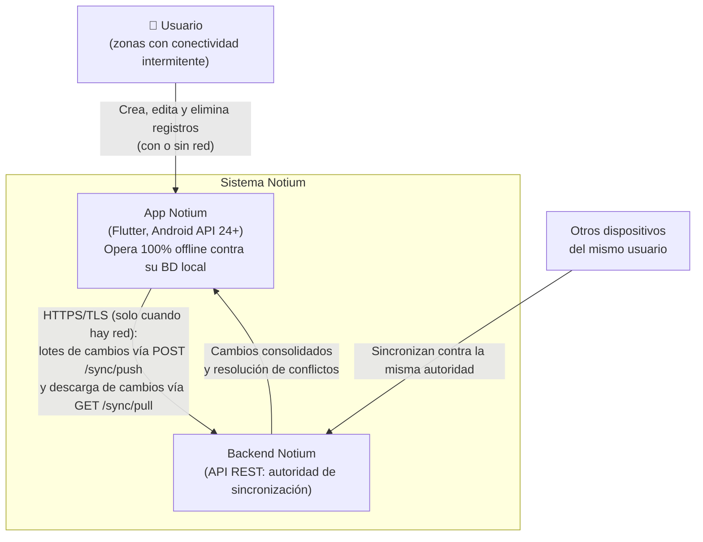
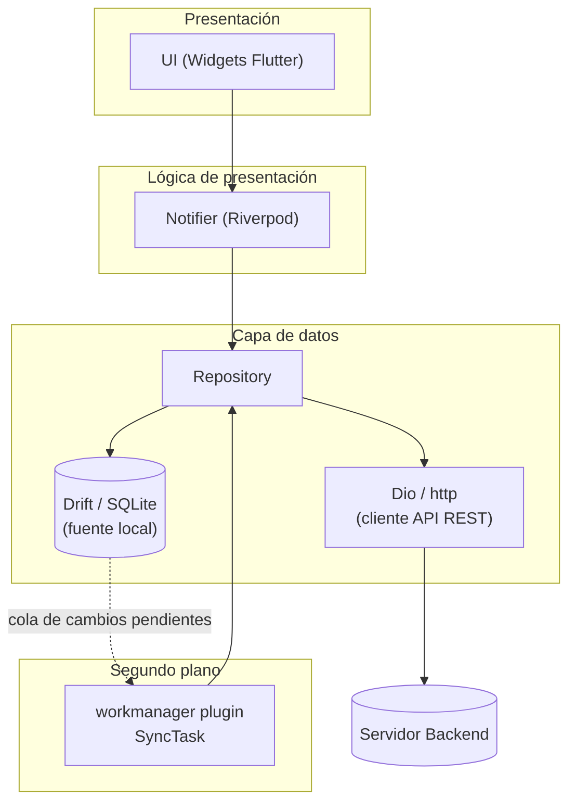
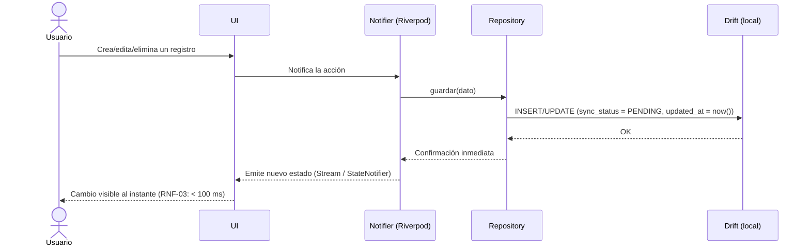
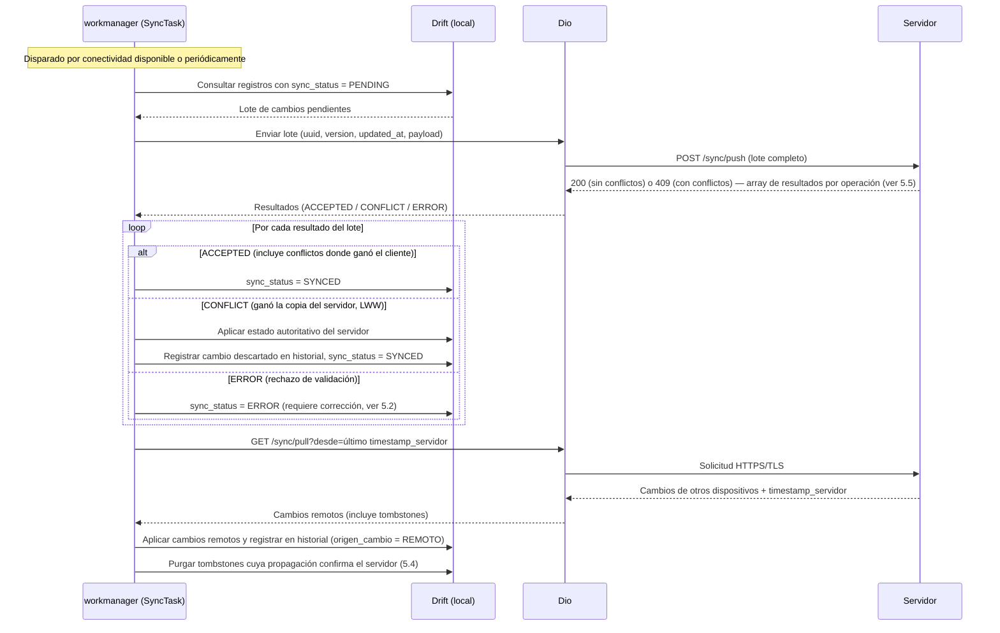
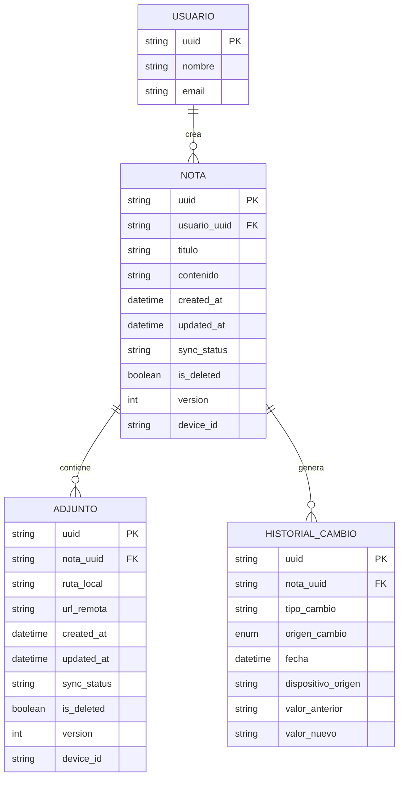
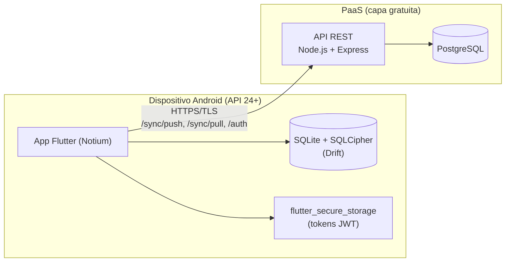

   # Documento de Arquitectura de Software

   <!-- ============================================ -->
   <!-- 1. PORTADA -->
   <!-- ============================================ -->

   <div align="center">

   # NOTIUM

   ## Propuesta de Arquitectura de Software

   ### Plataforma NOTIUM Offline-First
   ---

   **Versión:** 1.4

   **Fecha:** 07 de julio de 2026

   **Autor:** Jhonatan Castro

   **Rol:** Analista y Desarrollador de Software

   **Programa:** Tecnólogo en Análisis y Desarrollo de Software — SENA

   **Estado del documento:** Borrador

   </div>

   ---

   <!-- ============================================ -->
   <!-- 2. CONTROL DEL DOCUMENTO -->
   <!-- ============================================ -->

   ## Control del documento

   ### Información general

   | Campo                    | Detalle                                                     |
   | ------------------------ | ----------------------------------------------------------- |
   | **Nombre del documento** | Propuesta de Arquitectura — Notium                          |
   | **Versión actual**       | 1.4                                                         |
   | **Clasificación**        | Interno <!-- Opciones: Público / Interno / Confidencial --> |
   | **Autor principal**      | Jhonatan Castro                                             |


 ## 1. Resumen ejecutivo

### 1.1 Contexto y motivación

El presente documento responde al reto planteado en el programa ADSO:
diseñar una arquitectura para una aplicación Android capaz de operar sin conexión a Internet
y sincronizar sus datos con un servidor cuando la red esté disponible.

Este requisito, aparentemente simple, implica desafíos arquitectónicos
no triviales:

1. **Persistencia local:** toda la información debe estar disponible
   en el dispositivo, no solo en el servidor.
2. **Sincronización confiable:** los cambios hechos offline deben
   propagarse al servidor sin pérdida ni duplicación.
3. **Conflictos:** dos dispositivos pueden modificar el mismo dato
   sin conexión.
4. **Identidad de los datos:** los registros creados offline no pueden
   depender de IDs generados por el servidor.
5. **Historial de cambios:** el sistema debe mantener un historial
   auditable de los cambios realizados sobre los datos.

### 1.2 Objetivo de la solución

Desarrollar **Notium**, una aplicación Android con arquitectura
**offline-first**: toda operación de lectura y escritura se realiza
primero contra una base de datos local, garantizando
disponibilidad inmediata sin conexión. Un mecanismo de sincronización
en segundo plano (plugin `workmanager` + Dio/http) propaga los cambios
al servidor cuando la red está disponible. La persistencia local se
apoya en Drift sobre SQLite.

Este documento describe la arquitectura propuesta: componentes,
flujo de datos, decisiones técnicas y estrategia de sincronización.
No cubre el diseño de interfaz de usuario ni el plan de pruebas.

## 2. Requisitos que condicionan la arquitectura

### 2.1 Requisitos funcionales clave

Se listan únicamente los requisitos que condicionan decisiones de arquitectura, no el catálogo funcional completo.

| ID    | Requisito                                                                                    |
| ----- | --------------------------------------------------------------------------------------------- |
| RF-01 | El usuario puede crear, editar y eliminar registros sin conexión a Internet.                  |
| RF-02 | Los cambios hechos offline se sincronizan automáticamente al recuperar conectividad, sin intervención manual. |
| RF-03 | El sistema identifica de forma única cada registro sin depender de un ID asignado por el servidor. |
| RF-04 | El usuario puede ver el estado de sincronización de cada registro (pendiente, sincronizado, en conflicto o con error). |
| RF-05 | El sistema mantiene un historial de auditoría de los cambios realizados sobre cada registro.  |

### 2.2 Requisitos no funcionales
<!-- Los "-ilities". Sé específico y medible: -->
| ID     | Atributo       | Requisito                                          |
| ------ | -------------- | -------------------------------------------------- |
| RNF-01 | Disponibilidad | La app opera 100% offline por tiempo indefinido    |
| RNF-02 | Consistencia   | Los datos convergen tras la sincronización         |
| RNF-03 | Rendimiento    | Escritura local < 100 ms percibidos por el usuario |
| RNF-04 | Seguridad      | La base de datos local se cifra en reposo mediante SQLCipher (vía `drift_sqlcipher`); los tokens de sesión se almacenan en `flutter_secure_storage` |
| RNF-05 | Almacenamiento | El tamaño de la BD local no supera los 500 MB en uso normal; los adjuntos individuales están limitados a 10 MB |
| RNF-06 | Latencia de convergencia | Tras recuperar conectividad, el 95% de los cambios pendientes se sincronizan en menos de 30 segundos |

### 2.3 Restricciones

- **Plataforma:** el entregable inmediato es una aplicación Android instalable (mínimo API 24 — Android 7.0). El proyecto se desarrolla en Flutter (Dart) para habilitar la posibilidad de despliegue multiplataforma (iOS, web, desktop) en fases posteriores sin reescritura del código base. iOS y web quedan fuera del alcance actual pero no del diseño arquitectónico.
- **Conectividad:** la red del usuario final puede ser intermitente, de baja velocidad o inexistente por periodos prolongados (zonas rurales o de baja cobertura); no se puede asumir conectividad constante.
- **Backend:** se asume un servidor REST propio desarrollado para este proyecto, no un BaaS de terceros.

## 3. Vista general de la arquitectura

### 3.1 Estilo arquitectónico

Se adopta una **arquitectura por capas con Repository Pattern** y gestión de estado reactiva mediante **Riverpod**, con una capa de sincronización desacoplada, alineada con las buenas prácticas de la comunidad Flutter y con la separación clásica UI ↔ lógica ↔ datos. Justificación:

- **Single Source of Truth:** la base de datos local (Drift) es la única fuente de verdad para la UI. La UI nunca lee directamente de la red.
- **Testabilidad y adecuación al equipo:** los notificadores de estado (Riverpod) y el Repository son independientes del framework de UI y se prueban unitariamente sin emulador; el patrón cuenta además con amplia documentación y soporte de tooling en el ecosistema Flutter, reduciendo curva de aprendizaje y riesgo para un equipo de un solo desarrollador.
- **Reactividad:** Drift expone streams de Dart que se consumen mediante `StreamProvider`, por lo que la UI se actualiza automáticamente cuando cambian los datos locales, sin importar si el cambio vino del usuario o de una sincronización en segundo plano.

### 3.2 Diagrama de contexto (C4 — nivel 1)

Vista de máxima altitud del sistema: quién lo usa, de qué piezas se compone y cómo se comunican. La app es plenamente funcional sin el servidor; la conexión con el backend es una mejora oportunista, no una dependencia.



### 3.3 Diagrama de componentes



### 3.4 Flujo de datos

**a) Escritura local (ruta síncrona, sin red):**



**b) Sincronización en segundo plano (cuando hay red):**



### 3.5 Resumen del stack tecnológico

Vista consolidada de todas las tecnologías del sistema. La justificación detallada de cada elección está en el ADR o sección indicados.

| Área | Componente | Tecnología | Rol en la arquitectura | Decisión |
| ---- | ---------- | ---------- | ---------------------- | -------- |
| Cliente | Framework | Flutter (Dart) | Código base único para Android hoy y multiplataforma después | ADR-00 |
| Cliente | Estado / DI | Riverpod | Estado reactivo e inyección de dependencias; conecta la BD local con la UI | ADR-01 |
| Cliente | BD local | Drift sobre SQLite | Fuente única de verdad para la UI; streams reactivos y migraciones | ADR-02 |
| Cliente | Cifrado local | SQLCipher (`drift_sqlcipher`) | Cifrado en reposo de toda la data local | Sección 8 |
| Cliente | Sincronización | Plugin `workmanager` | Ejecución en segundo plano con restricción de red, sobrevive al cierre de la app | ADR-03 |
| Cliente | Cliente HTTP | Dio | Comunicación con la API: interceptores, reintentos, cancelación | ADR-04 |
| Cliente | Secretos | `flutter_secure_storage` | Tokens JWT en Android Keystore / iOS Keychain | Sección 8 |
| Backend | Runtime / framework | Node.js (LTS) + Express | API REST: autenticación y endpoint de sincronización | ADR-05 |
| Backend | Base de datos | PostgreSQL | Persistencia autoritativa del estado consolidado | ADR-05 |
| Backend | Autenticación | JWT (access + refresh) | Sesiones sin estado, compatibles con validación offline | Sección 8 |
| Infraestructura | Despliegue | PaaS capa gratuita (Render / Railway / Fly.io) | Hosting del backend sin administración de servidores ni costo | Sección 6.2 |
| Transversal | Transporte | HTTPS/TLS | Cifrado de toda la comunicación cliente-servidor | Sección 8 |

## 4. Modelo de datos

### 4.1 Entidades principales



*Nota: `NOTA` es la entidad de dominio genérica de Notium; el mismo patrón de metadatos de sincronización se replica en cualquier entidad que el usuario pueda crear offline.*

*Nota: la entidad `USUARIO` no almacena tokens de sesión; estos se guardan en `flutter_secure_storage`, fuera de la base de datos local (ver sección 8). El campo `origen_cambio` de `HISTORIAL_CAMBIO` toma los valores `LOCAL`, `REMOTO` o `CONFLICTO_DESCARTADO` (ver 5.3).*

### 4.2 Metadatos de sincronización

Todas las entidades sincronizables incluyen estos campos, independientemente de su dominio. Se implementan como columnas de tablas Drift, con tipos Dart equivalentes (`String`, `DateTime`, `bool`, `int` y un `enum` de Dart para `sync_status`):

| Campo         | Tipo     | Propósito                                                                 |
| ------------- | -------- | -------------------------------------------------------------------------- |
| `uuid`        | string   | Identificador único generado en el cliente (UUID v4). Ver 5.1.             |
| `created_at`  | datetime | Momento de creación local, usado en auditoría.                            |
| `updated_at`  | datetime | Última modificación; base para resolución de conflictos (Last-Write-Wins). |
| `sync_status` | enum     | `PENDING`, `SYNCED`, `CONFLICT` o `ERROR`. Determina qué registros procesa la `SyncTask`.   |
| `is_deleted`  | boolean  | Marca de borrado lógico (tombstone). Ver 5.4.                             |
| `version`     | int      | Contador incremental para detectar ediciones concurrentes.                |
| `device_id`   | string   | Dispositivo de origen del último cambio, útil para trazabilidad en el historial. |

## 5. Estrategia de sincronización

### 5.1 Identificadores

Cada registro creado offline recibe un **UUID v4 generado en el cliente** en el momento de la creación, en lugar de esperar un ID autoincremental del servidor.

**Por qué:** con IDs de servidor, un registro creado sin conexión no tendría identidad hasta sincronizar, bloqueando referencias entre entidades (ej. un adjunto que apunta a una nota) mientras el dispositivo esté offline. Un UUID v4 tiene colisión estadísticamente despreciable, permite que el cliente cree relaciones completas sin red y hace que el servidor solo necesite *aceptar* el identificador en vez de *asignarlo*.

### 5.2 Detección de cambios

Cada registro sincronizable mantiene un campo `sync_status` (ver 4.2). Al crear, editar o eliminar localmente, la escritura correspondiente en Drift marca el registro como `PENDING` en la misma transacción.

La `SyncTask` (plugin `workmanager`) consulta periódicamente y ante eventos de conectividad los registros con `sync_status = PENDING`, formando una cola de trabajo implícita (no se requiere una tabla de cola separada; el propio flag actúa como cola, simplificando el modelo dado el equipo de un solo desarrollador).

**Ciclo de vida de `sync_status`:** todo registro sincronizable transita por esta máquina de estados, que es la que la UI expone al usuario (RF-04):

```mermaid
stateDiagram-v2
    [*] --> PENDING : Creación, edición o borrado local\n(misma transacción Drift)
    PENDING --> SYNCED : Servidor responde ACCEPTED
    PENDING --> CONFLICT : Servidor responde CONFLICT\n(edición concurrente; ganó la copia del servidor)
    PENDING --> ERROR : Rechazo de validación del servidor\n(fallo no recuperable por reintento)
    CONFLICT --> SYNCED : Estado autoritativo del servidor aplicado\n+ registro en HISTORIAL_CAMBIO (5.3)
    ERROR --> PENDING : Corrección local del dato\n(nueva edición del usuario)
    SYNCED --> PENDING : Nueva edición o borrado local
    SYNCED --> [*] : Purga física del tombstone\ntras confirmación de propagación (5.4)
```



*Nota: los fallos transitorios de red no cambian el estado — el registro permanece en `PENDING` y el siguiente ciclo de la `SyncTask` lo reintenta, con el backoff exponencial que gestiona `workmanager`. `ERROR` se reserva para rechazos explícitos del servidor: reintentar automáticamente el mismo payload produciría el mismo rechazo, por lo que la salida de este estado exige una corrección del dato por parte del usuario.*

### 5.3 Resolución de conflictos

Se adopta **Last-Write-Wins (LWW)** basado en el campo `updated_at`, complementado con el campo `version` para detectar que hubo edición concurrente:

1. Al sincronizar, el cliente envía `updated_at` y `version` (la última versión del servidor que conoce) junto con el cambio.
2. Si la `version` enviada coincide con la del servidor, no hubo edición concurrente: el cambio se aplica y se responde `ACCEPTED`.
3. Si las versiones difieren, hubo edición concurrente y el **servidor** resuelve comparando los `updated_at`: prevalece la escritura más reciente (LWW).
   - Si gana el cambio del cliente, se aplica al estado autoritativo y se responde `ACCEPTED`; la versión anterior del servidor se conserva en su historial con `origen_cambio = CONFLICTO_DESCARTADO`.
   - Si gana la copia del servidor, se responde `CONFLICT` con el estado autoritativo; el cliente sobrescribe su copia local y conserva su cambio descartado en `HISTORIAL_CAMBIO` con `origen_cambio = CONFLICTO_DESCARTADO` (RF-05), de modo que el usuario pueda revisar qué pasó.

**Justificación:** LWW es la estrategia de menor complejidad de implementación y suficiente para el caso de uso (notas/registros de un usuario, no edición colaborativa en tiempo real; ver Kleppmann, 2017, cap. 5 sobre replicación). Alternativas como CRDTs o merge manual campo a campo se descartaron por el sobrecosto de desarrollo que implican frente al alcance y al equipo disponible (restricción 2.3). El registro en el historial mitiga la principal desventaja de LWW (pérdida silenciosa de datos) dejando trazabilidad completa.

### 5.4 Manejo de eliminaciones

Se usa **soft delete (tombstones)**: eliminar un registro localmente no lo borra físicamente, sino que marca `is_deleted = true` y `sync_status = PENDING`.

- El tombstone se sincroniza como cualquier otro cambio, propagando la eliminación a los demás dispositivos del usuario.
- Una vez que el servidor confirma haber propagado el tombstone a todos los dispositivos (o transcurre una ventana de gracia configurable), un job de limpieza lo purga físicamente de la base de datos local, conteniendo el crecimiento de la BD (riesgo en sección 9).

**Por qué no borrado físico inmediato:** sin tombstone, un dispositivo que estuvo offline durante la eliminación nunca se enteraría del cambio al reconectar (no hay registro que sincronizar), dejando datos "resucitados" o inconsistentes entre dispositivos.

### 5.5 Contrato de los endpoints de sincronización

La sincronización se compone de dos endpoints complementarios: `POST /sync/push` (subida de cambios locales) y `GET /sync/pull` (descarga de cambios remotos). El contrato completo está formalizado en `openapi.yaml`.

**Subida de cambios — `POST /sync/push`:** acepta un **lote (array) de operaciones** y devuelve un **array de resultados en el mismo orden**, de modo que el cliente pueda correlacionar cada resultado con su operación de origen. La respuesta es `200` si no hubo conflictos y `409` si al menos una operación resultó en `CONFLICT`; en ambos casos el cuerpo trae el array completo de resultados y las operaciones sin conflicto del mismo lote quedan aplicadas.

- **Cada operación de entrada incluye:** `uuid`, `entidad`, `operacion` (`CREATE`, `UPDATE` o `DELETE`), `payload`, `updated_at` y `version`. El `device_id` se envía una sola vez a nivel del lote, dado que todas las operaciones de un envío provienen del mismo dispositivo.
- **Cada resultado de salida incluye:** `uuid`, `estado` (`ACCEPTED`, `CONFLICT` o `ERROR`) y, en caso de conflicto, el estado autoritativo del servidor para que el cliente lo aplique localmente (ver 5.3).
- **Idempotencia:** el endpoint es idempotente por la clave `(uuid, version)` (ver glosario): reenviar la misma operación —por ejemplo, tras un reintento de la `SyncTask`— no duplica datos; el servidor reconoce la clave ya procesada y devuelve el mismo resultado. Una edición legítima posterior al mismo registro parte de una `version` base distinta, por lo que nunca se confunde con un reintento.

**Descarga de cambios — `GET /sync/pull`:** devuelve los cambios del usuario autenticado posteriores a la marca de tiempo `desde` (el `timestamp_servidor` de la última respuesta, que el cliente persiste), incluyendo tombstones para propagar eliminaciones (5.4). El parámetro opcional `device_id` excluye los cambios originados por el propio dispositivo (evita ecos) y `limite` pagina la respuesta (`hay_mas` indica si quedan páginas). La `SyncTask` ejecuta el pull tras cada push exitoso, aplicando los cambios remotos localmente con registro en `HISTORIAL_CAMBIO` (`origen_cambio = REMOTO`), lo que garantiza la convergencia entre dispositivos (RNF-02).

**Ejemplo de solicitud (`POST /sync/push`):**

```json
{
  "device_id": "disp-8842",
  "operaciones": [
    {
      "uuid": "3fa85f64-5717-4562-b3fc-2c963f66afa6",
      "entidad": "NOTA",
      "operacion": "CREATE",
      "payload": { "titulo": "Acta de reunión", "contenido": "..." },
      "updated_at": "2026-07-06T10:15:00Z",
      "version": 1
    },
    {
      "uuid": "9b2e4c1a-0d3f-4e7b-a1c5-6f8d2e9b7a41",
      "entidad": "NOTA",
      "operacion": "UPDATE",
      "payload": { "titulo": "Presupuesto v2" },
      "updated_at": "2026-07-06T10:16:30Z",
      "version": 3
    }
  ]
}
```

**Ejemplo de respuesta (`409`, un conflicto en el lote):**

```json
{
  "resultados": [
    {
      "uuid": "3fa85f64-5717-4562-b3fc-2c963f66afa6",
      "estado": "ACCEPTED"
    },
    {
      "uuid": "9b2e4c1a-0d3f-4e7b-a1c5-6f8d2e9b7a41",
      "estado": "CONFLICT",
      "version_servidor": 4,
      "payload_servidor": { "titulo": "Presupuesto v3", "updated_at": "2026-07-06T10:16:45Z" }
    }
  ]
}
```

## 6. Arquitectura del backend

### 6.1 Rol del backend

El backend **no es la fuente de datos de la UI** (ese rol lo cumple la base de datos local, ver 3.1); su función es ser la **autoridad de sincronización**: recibe los lotes de cambios de todos los dispositivos, detecta conflictos, mantiene el estado consolidado por usuario y lo redistribuye. Sus responsabilidades son:

1. **Autenticación:** emisión y refresco de tokens JWT (access + refresh).
2. **Sincronización:** implementación de los contratos `POST /sync/push` y `GET /sync/pull` (ver 5.5), incluyendo detección de conflictos por `version`/`updated_at` y garantía de idempotencia por la clave `(uuid, version)`.
3. **Persistencia autoritativa:** almacenamiento del estado consolidado de cada entidad, su historial de cambios y los tombstones pendientes de propagar.
4. **Control de acceso:** validación de que cada operación pertenece al usuario autenticado (ver sección 8).
5. **Adjuntos:** recepción y entrega de los binarios de los adjuntos (≤ 10 MB, RNF-05) mediante un endpoint dedicado (`POST /attachments`, multipart), almacenándolos en el sistema de archivos u objeto de almacenamiento del PaaS; por `POST /sync/push` viajan únicamente los metadatos de la entidad `ADJUNTO`.

### 6.2 Stack del servidor

| Componente | Tecnología | Justificación breve |
| ---------- | ---------- | ------------------- |
| Runtime / framework | Node.js (LTS) + Express | API REST pequeña (pocos endpoints), ecosistema masivo, curva de aprendizaje baja y hosting gratuito abundante; adecuado para un solo desarrollador (ver ADR-05). |
| Base de datos | PostgreSQL | El modelo es relacional (ver 4.1) y se replica 1:1 en el servidor; PostgreSQL está disponible en los planes gratuitos de los proveedores considerados. |
| Autenticación | JWT (access + refresh) | Sin estado en el servidor, compatible con la validación local de expiración que hace el cliente offline (ver sección 8). |
| Despliegue | PaaS de capa gratuita (Render / Railway / Fly.io) | Cumple la restricción de presupuesto (2.3) sin administrar servidores; el despliegue es un contenedor único, acorde a la complejidad operativa que un desarrollador puede mantener. |

### 6.3 Persistencia autoritativa e idempotencia

El servidor replica las entidades del modelo de datos (sección 4) con sus mismos metadatos de sincronización, y añade una tabla propia:

- **`OPERACION_PROCESADA`** (`uuid`, `version`, `resultado`, `procesada_en`): registro de las operaciones ya aplicadas, indexado por la clave de idempotencia `(uuid, version)` definida en 5.5. Cuando la `SyncTask` reintenta un lote (por timeout o fallo de red tras aplicar los cambios), el servidor reconoce las claves ya procesadas y devuelve el resultado original sin volver a aplicar la operación.
- El campo `version` de cada entidad se incrementa **solo en el servidor** al aceptar un cambio (el cliente lo inicializa en `1` únicamente al crear el registro, como en el ejemplo de 5.5); esa versión autoritativa es la que se compara en la detección de conflictos (5.3).

### 6.4 Diagrama de despliegue



## 7. Decisiones de arquitectura (ADRs)

| ID     | Decisión              | Alternativas consideradas | Justificación |
| ------ | --------------------- | -------------------------- | ------------- |
| ADR-00 | Flutter (Dart) como framework de desarrollo | Android nativo (Kotlin + Jetpack Compose), React Native, Kotlin Multiplatform (KMP) | El entregable inmediato es Android (restricción 2.3), pero el proyecto aspira a iOS/web/desktop en fases posteriores con un equipo de un solo desarrollador: Flutter permite un único código base y una única curva de aprendizaje para todas las plataformas. Su ecosistema cubre de forma madura cada pieza crítica de esta arquitectura offline-first (Drift para SQLite reactivo, plugin `workmanager` sobre las APIs nativas de tareas en segundo plano, `flutter_secure_storage`, `drift_sqlcipher`), por lo que la elección no sacrifica capacidades nativas relevantes para el caso de uso. **Android nativo (Kotlin)** daría acceso directo a Room/WorkManager y es la opción canónica para el reto ADSO, pero encierra el proyecto en Android y obligaría a reescribir el código base completo para cualquier otra plataforma, contradiciendo la restricción de equipo unipersonal. **React Native** depende del puente JavaScript↔nativo y su soporte para SQLite cifrado y tareas en segundo plano confiables es más fragmentado, justo las dos capacidades centrales de esta arquitectura. **KMP** comparte lógica pero no UI estable en todas las plataformas objetivo (Compose Multiplatform aún en maduración para web) y exige dominar dos ecosistemas (Kotlin + Swift/UI nativa), duplicando el esfuerzo para un solo desarrollador. |
| ADR-01 | Arquitectura por capas + Riverpod | BLoC, Provider, GetX, MVC clásico | Riverpod ofrece inyección de dependencias y estado reactivo con tipado fuerte y sin dependencia del árbol de widgets, garantizando el principio de Single Source of Truth (la UI consume únicamente la base de datos local a través del `Repository`). BLoC introduce más boilerplate del necesario para un equipo de un solo desarrollador; Provider es más limitado en composición; GetX mezcla responsabilidades y tiene menor adopción en proyectos serios. |
| ADR-02 | Drift como BD local   | sqflite puro, Isar, Hive, Realm | Drift genera código a partir de SQL validado en tiempo de compilación, soporta migraciones versionadas e integra streams reactivos que se consumen directamente en `StreamProvider`. sqflite obliga a escribir SQL crudo sin tipado; Isar y Hive son NoSQL y complican relaciones y consultas complejas; Realm implica un motor propietario y menor control. |
| ADR-03 | Plugin `workmanager` para sincronización | flutter_background_service, timers en foreground, Isolates manuales | El plugin `workmanager` expone la API nativa de WorkManager de Android (y BGTaskScheduler en iOS), garantizando ejecución diferida con restricciones de red incluso si la app se cierra. Un servicio en foreground exige notificación persistente y drena batería; los timers no sobreviven al cierre del proceso. |
| ADR-04 | Dio como cliente HTTP | Paquete `http` oficial, Chopper, Retrofit para Dart | Dio ofrece interceptores, cancelación de peticiones, manejo de `FormData` y reintentos configurables, ideales para una capa de sincronización robusta. El paquete `http` es más limitado; Chopper y Retrofit-Dart agregan generación de código innecesaria para el volumen actual de endpoints. |
| ADR-05 | Node.js + Express + PostgreSQL en el backend | Spring Boot (Java), FastAPI (Python), Dart en servidor (shelf / Serverpod), BaaS (Firebase / Supabase) | La API expone pocos endpoints (auth y `/sync/push` + `/sync/pull`) y su lógica principal es detección de conflictos e idempotencia, no procesamiento pesado: Node.js + Express la resuelve con mínima configuración, enorme documentación y despliegue gratuito en cualquier PaaS (restricción de presupuesto, 2.3). PostgreSQL replica el modelo relacional del cliente (sección 4) sin traducción de paradigma. **Spring Boot** es robusto pero su peso operativo (memoria, arranque, configuración) excede lo que la capa gratuita de un PaaS tolera bien. **FastAPI** es comparable a Express, pero no aporta ventajas que justifiquen sumar un tercer lenguaje al proyecto. **Dart en servidor** unificaría el lenguaje con el cliente, pero su ecosistema backend (shelf, Serverpod) es inmaduro frente a Node y con menos documentación para resolver problemas. **Un BaaS** contradice la restricción 2.3 de backend REST propio y ocultaría justamente la lógica de sincronización que este proyecto debe demostrar. |

## 8. Seguridad

- **Autenticación offline:** al iniciar sesión con red, se cachea un par de tokens JWT (access + refresh) en `flutter_secure_storage` (que internamente usa Android Keystore en Android y Keychain en iOS). Mientras no hay red, la app valida localmente la expiración del token para permitir el uso continuo; al reconectar, se intenta refrescar el token automáticamente antes de sincronizar.
- **Cifrado local:** la base de datos Drift se cifra en reposo mediante SQLCipher (`sqlcipher_flutter_libs` + `drift_sqlcipher`) para proteger la información ante pérdida o robo del dispositivo, dado que toda la data del usuario reside localmente por diseño offline-first.
- **Comunicación segura:** toda comunicación con el servidor usa HTTPS/TLS; no se sincroniza dato alguno por canales sin cifrar.
- **Control de acceso:** cada registro está asociado a un `usuario_uuid`; el servidor valida la pertenencia del recurso antes de aceptar cualquier cambio sincronizado, evitando que un dispositivo comprometido modifique datos de otro usuario.
- **Manejo de secretos:** no se embeben claves ni credenciales de API en el código fuente; se gestionan vía archivos `.env` con `flutter_dotenv` o mediante `--dart-define` en tiempo de compilación.

## 9. Riesgos y mitigaciones
| Riesgo                                          | Impacto | Mitigación |
| ------------------------------------------------ | ------- | ---------- |
| Conflictos de edición simultánea                  | Alto    | Resolución Last-Write-Wins + campo `version`, con registro en el historial de auditoría (RF-05) para revisión posterior. |
| Crecimiento de la BD local                        | Medio   | Purga periódica de tombstones ya confirmados por el servidor y limpieza/archivado de historial de auditoría antiguo. |
| Pérdida de datos por fallo durante la sincronización | Alto    | Transacciones atómicas en Drift; cola de reintentos con backoff exponencial gestionada por el plugin `workmanager`. |
| Token de sesión expirado estando offline          | Medio   | Ventana de expiración extendida en caché local; se bloquean solo operaciones sensibles hasta reautenticar, no el uso general offline. |
| Dispositivo perdido o robado con datos sensibles  | Alto    | Cifrado de la base de datos local (SQLCipher) y opción de invalidar sesión remotamente en la próxima conexión del dispositivo. |

## 10. Glosario

| Término | Definición |
| ------- | ---------- |
| **Offline-first** | Paradigma de diseño donde la aplicación funciona completamente sin conexión y trata la red como una mejora opcional, no como un requisito para operar. |
| **Tombstone** | Registro marcado como eliminado (`is_deleted = true`) que se conserva temporalmente para propagar la eliminación a otros dispositivos antes de purgarse. |
| **Idempotencia** | Propiedad de una operación que produce el mismo resultado sin importar cuántas veces se ejecute; crítica para que los reintentos de sincronización no dupliquen datos. |
| **Last-Write-Wins (LWW)** | Estrategia de resolución de conflictos en la que la escritura con el `updated_at` más reciente prevalece sobre las demás. |
| **UUID v4** | Identificador único universal generado aleatoriamente en el cliente, sin necesidad de coordinación con el servidor. |
| **Single Source of Truth** | Principio de diseño donde una única fuente de datos (la base de datos local) es la autoridad del estado de la aplicación para la UI. |
| **Sync status** | Estado de un registro respecto a su sincronización con el servidor: `PENDING`, `SYNCED`, `CONFLICT` o `ERROR`. |
| **Riverpod** | Librería de gestión de estado e inyección de dependencias para Flutter, basada en providers reactivos con tipado fuerte. |
| **Drift** | ORM reactivo para Dart/Flutter sobre SQLite, con validación de SQL en tiempo de compilación y soporte para streams. |

## 11. Referencias

- Flutter. *Architecting your Flutter application.* https://docs.flutter.dev/app-architecture
- Drift. *Drift documentation.* https://drift.simonbinder.eu/
- Riverpod. *Riverpod documentation.* https://riverpod.dev/
- Plugin `workmanager`. https://pub.dev/packages/workmanager
- Dio. https://pub.dev/packages/dio
- Kleppmann, M. (2017). *Designing Data-Intensive Applications.* O'Reilly Media.

## 12. Changelog

| Versión | Fecha               | Resumen de cambios |
| ------- | ------------------- | ------------------ |
| 1.0     | 06 de julio de 2026 | Borrador inicial de la propuesta de arquitectura (stack Android nativo). |
| 1.1     | 06 de julio de 2026 | Migración del stack a Flutter (Riverpod, Drift, Dio, plugin `workmanager`) y ajustes de calidad: trazabilidad de conflictos (`origen_cambio`), nuevos RNF de seguridad, almacenamiento y latencia de convergencia, contrato del endpoint `/sync`, corrección del diagrama ER, consolidación de la sección 3.1 y correcciones de redacción. |
| 1.2     | 07 de julio de 2026 | Nuevo ADR-00 (elección de Flutter) con renumeración de ADRs; nueva sección 6 «Arquitectura del backend» (rol, stack Node.js + Express + PostgreSQL, idempotencia, ADR-05) con renumeración de secciones 7–12; resumen del stack tecnológico (3.5); nuevos diagramas de contexto (3.2), despliegue (6.4) y máquina de estados de `sync_status` (5.2). |
| 1.3     | 07 de julio de 2026 | Correcciones de consistencia: algoritmo LWW alineado con su definición (el servidor resuelve comparando `updated_at`, 5.3 y 3.4b); salida del estado `ERROR` por corrección del usuario en lugar de reintento automático (5.2); clave de idempotencia redefinida como `(uuid, version)` (5.5 y 6.3); diagrama 3.4b ajustado al contrato por lote (respuesta única con resultados por operación); `device_id` unificado a nivel de lote; metadatos de sincronización completados en `NOTA` y `ADJUNTO` (4.1); estado `ERROR` incluido en RF-04; responsabilidad de adjuntos añadida al backend (6.1); criterio de purga de tombstones unificado con 5.4. |
| 1.4     | 07 de julio de 2026 | Alineación con `openapi.yaml`: el contrato de sincronización se divide en `POST /sync/push` (subida de lotes, respuesta 200/409) y `GET /sync/pull` (descarga incremental de cambios remotos por `timestamp_servidor`, con exclusión de ecos por `device_id` y paginación), cerrando el vacío sobre cómo el cliente recibe cambios de otros dispositivos (5.5, 3.2, 3.4b, 6.1, 6.4, ADR-05); endpoint de adjuntos renombrado a `POST /attachments` (6.1). |
